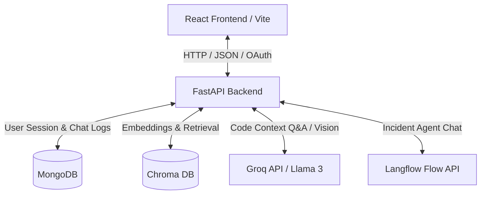
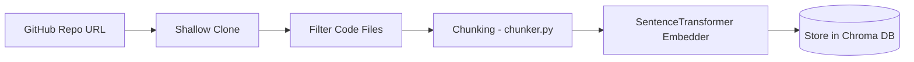

# NexAgent — Autonomous DevOps & Repository Analysis Platform

NexAgent is a state-of-the-art autonomous DevOps Incident Response and Repository Analysis platform. It leverages multi-agent pipelines for incident troubleshooting and a Retrieval-Augmented Generation (RAG) system for codebase question answering.

---

## 1. System Architecture

NexAgent consists of a decoupled frontend and backend. Below is the system architecture showing how components interact:



### Components Summary

1. **Frontend**: React single-page application built with Vite and styled using high-end CSS aesthetics (frosted glass glassmorphism, responsive navigation, custom theme modes).
2. **Backend**: FastAPI web server structured into Routers, Controllers, Models, and Services in Python.
3. **Database (MongoDB)**: Keeps records of registered users, chat history, and active sessions.
4. **Vector DB (Chroma DB)**: Persistent vector database for indexing and performing semantic searches over chunked codebases.
5. **AI Orchestrator (Langflow)**: Coordinates multi-agent workflows (Triage, Diagnosis, Remediation, Escalation, Report).
6. **LLM Provider (Groq)**: Powers semantic code-completion using Llama models (`llama-3.3-70b-versatile`) and multimodal code+image analysis (`llama-3.2-11b-vision-preview`).

---

## 2. RAG (Retrieval-Augmented Generation) Pipeline

The Repo Analysis screen uses a local RAG engine to query complex codebases. The process is split into two phases:

### Indexing Phase


- **Cloning**: The repository is cloned locally to `server/repos/` via a shallow clone.
- **Chunking**: Code files matching standard extensions (e.g. `.py`, `.js`, `.ts`, `.tsx`, `.go`, `.rs`, `.yaml`) are parsed and split into chunks of **100 characters** with a **15-character overlap** (defined in [settings.py](file:///c:/Users/sk200/Desktop/NexAgent/backend-frontend/server/config/settings.py)).
- **Embedding**: Each chunk is embedded using the `SentenceTransformer("all-MiniLM-L6-v2")` model.
- **Persistence**: Vectors are saved to the local directory `server/chroma_db/`.

### Retrieval & Generation Phase
- **Semantic Search**: The user's question is embedded and query-matched against the Chroma DB collection to retrieve the top `6` code chunks.
- **Context Construction**: Code snippets are organized with references to filenames and exact lines.
- **Multimodal Support**: If a user attaches a screenshot, the system uses Groq's vision LLM (`llama-3.2-11b-vision-preview`) to analyze the visual feedback along with the code context. Otherwise, Groq's `llama-3.3-70b-versatile` text model is used.

---

## 3. Langflow Integration

The **Incident Chat** interface provides a workspace to diagnose live infrastructure alerts. Behind the scenes, the FastAPI server acts as a proxy to a **Langflow** server:

- The route handler calls `chat_with_langflow()` inside [chat_service.py](file:///c:/Users/sk200/Desktop/NexAgent/backend-frontend/server/services/chat_service.py).
- A POST request containing the message, session ID, and routing parameters is dispatched to the Langflow runtime URL (`LANGFLOW_URL`).
- Langflow coordinates specialized agent nodes:
  - **Triage Agent**: Classifies the alert severity and affected components.
  - **Diagnostic Agent**: Traces logs and checks resource latencies to detect root causes.
  - **Remediation Agent**: Recommends/triggers action plans or playbooks.
- The returned JSON response is parsed programmatically to yield clean chatbot messages.

---

## 4. Setup Guide

### A. Backend Setup (`server/`)

#### 1. System Prerequisites
- **Python**: version 3.10 or newer.
- **MongoDB**: A running MongoDB instance locally (`mongodb://localhost:27017`) or a remote connection string.

#### 2. Environment Configuration
Create a `.env` file inside `backend-frontend/server/.env` and populate it:

```env
PORT=8000
MONGODB_URI=mongodb://localhost:27017/nexagent
SESSION_SECRET_KEY=your-session-secret-key
JWT_SECRET_KEY=your-jwt-secret-key

# Groq API Configuration
GROQ_API_KEY=gsk_your_groq_api_key

# Langflow Flow Configuration
LANGFLOW_URL=http://127.0.0.1:7860/api/v1/run/your-flow-id
LANGFLOW_API_KEY=your-langflow-api-key

# Google OAuth Setup (Optional - for Sign In with Google)
GOOGLE_CLIENT_ID=your-google-client-id
GOOGLE_CLIENT_SECRET=your-google-client-secret
GOOGLE_REDIRECT_URI=http://localhost:8000/auth/callback
FRONTEND_URL=http://localhost:5173
```

#### 3. Start the Server
Run the following terminal commands inside `backend-frontend/server/`:

```powershell
# Create virtual environment
python -m venv .venv

# Activate virtual environment
.venv\Scripts\Activate.ps1

# Install requirements
pip install -r requirements.txt

# Launch FastAPI app
python app.py
```
The server will boot up on `http://localhost:8000` with Swagger docs available at `http://localhost:8000/docs`.

---

### B. Frontend Setup (`client/`)

#### 1. System Prerequisites
- **Node.js**: version 18 or newer.
- **npm / pnpm / yarn**: Package managers.

#### 2. Environment Configuration
Create a `.env` file inside `backend-frontend/client/.env`:

```env
VITE_API_URL=http://localhost:8000
```

#### 3. Run Development Server
Run the following terminal commands inside `backend-frontend/client/`:

```powershell
# Install node dependencies
npm install

# Start the Vite development server
npm run dev
```

The web UI will start at `http://localhost:5173/`.
